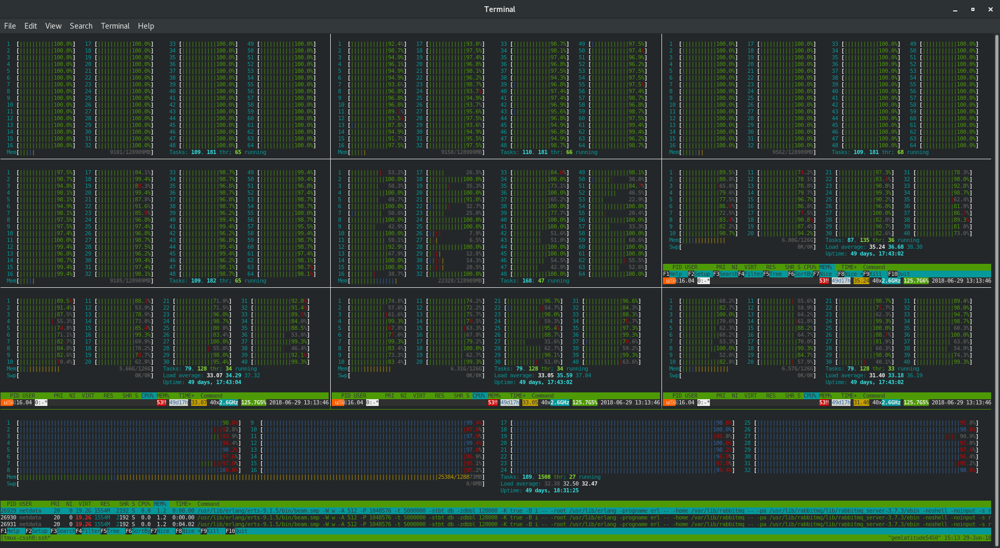

Python in scientific computing
------------------------------

*what works and what doesn't*

Michele Simionato@[GEM Foundation](https://www.globalquakemodel.org)

+++?image=SHARE.png

---

**what I mean by scientific computing**

- Distributed numerical simulations
- Lots of data being generated
- Nontrivial postprocessing
- Issues with CPU time, memory and data transfer

+++



---

**what's behind: @color[green](numpy/scipy)**


- numpy and scipy are good @fa[thumbs-up]
- had troubles with returning back structured arrays


---

**what's behind: @color[green](h5py/hdf5)**

- it is good but tricky
- lots and lots of issues with structured arrays/variable length arrays
- several issues with bytes/strings at the time of the Python 2->3 migration
- recent debacle with the HDF5 1.8 -> 1.10 upgrade
- tip: silx view is a lot better than HDFView

---

**what's behind: @color[green](geospatial libraries)**

- scipy.spatial.distance is really good
- scipy.spatial.KDTree is fine except the docs
- rtree is fine but I had problems with index bulk inserts in
  the previous release
- rtree/shapely/libgeos/gdal/basemap/cartopy etc are really hard to support
  on all platforms
- QGIS: ask me more after the end of the talk

---

**what's behind: @color[gray](celery/rabbitmq)**


- celery/rabbitmq is not ideal
- we have celery for legacy reasons and because there was no dominant task
  scheduler in the Python world
  
+++

**what's behind: @color[gray](celery/rabbitmq)**

- rabbitmq is meant for lots of small messages, but instead we have few
  huge messages
- rabbitmq is meant for resilience more than performance
- it stores everything in the mnesia
  database, but we do not need that and it is counterproductive
- we had problems with specific versions of rabbitmq
- lots of configurations the users can get wrong

+++

**what's behind: @color[gray](celery/rabbitmq)**


- using celery/redis did not work out (missing revoke)
- celery was keeping in memory all task results
- the default configuration is not the ideal one for use
  (*worker_prefetch_multiplier*, *result_cache_max*)
- we had celery waiting for already completed tasks :-(

+++

**what's behind: @color[gray](celery/rabbitmq)**

- celery has 50,000+ lines of code, while rabbitmq is in Erlang
- if something does not work, you are dead (but the mailing list is helpful)
- there are strong limits on the amount of data you can transfer in a
  short time

---

**what's behind: @color[green](zmq)**


- I studied the zmq book after EuroPython 2017
- I implemented what I needed in 2-3 days
- it worked really well, even if not at the first attempt

---

**what's behind: @color[green](zmq)**

- data is sent back via zmq now (PUSH/PULL pattern)
- we bypassed celery/rabbitmq limits completely
- one must be careful: sent packets keep circulating
- we have a plan B if celery/rabbitmq should fail us, but we are
  not reinventing the wheel

---

**what we might be using: @color[gray](dask)**

- not used until now because we are conservative
- the documentation has improved a lot
- `dask.distributed.Client.map` is the easy migration path I was looking for
- we are not using it in production but we have experimental support for it
- we'd love to hear from you :-)

---

**what we are NOT using**

- @color[red](C extensions)
- @color[red](Cython)
- @color[red](numba)
- @color[red](Intel Python)

*we do not add dependencies lightly*

---?image=collapse.jpg

@color[white](what about architecture?)

+++

- however good the underlying libraries, your software will collapse
  if you have the wrong architecture (speaking from experience)

+++

**some bottleneck are less obvious**

- if transferring data is the big issue, consider using a distributed filesystem
- NFS was really good for us

+++

**some bottleneck are just not there**

- I you need to write a lot of data the single writer
  architecture scales a lot more than one could expect (> 10 GB/minute)
- tip: disabling the swap is a good idea

+++

- for speed, it is *essential* to find out the right data structure in HDF5
- at the end a structured array plus a dataset with variable-length indices
  was the best approach for the GMFs

+++

- variable-length data types are convenient, but tricky and not well
  supported by the tools (HDFView, silx view)

---

**More on h5py/hdf5**

- h5py is really nice and Pythonic (but comes with caveats)
- it makes a lot of sense to serialize Python objects to HDF5
- it was easy to define a serialization protocol:

```python
    def __toh5__(self):
        return self.grouparray, self.attrs
        
    def __fromh5__(self, grouparray, attrs):
        self.grouparray = grouparray
        self.attrs = attrs
```
+++

**There is an OpenQuake HDF5 serialization library**

*(free, with AGPL licence :-)*

```python
    with openquake.baselib.hdf5.File('x.hdf5', 'w') as f:
         f[key] = obj 
        
    with openquake.baselib.hdf5.File('x.hdf5', 'r') as f:
         obj = f[key] 
```

- we are converting our input files from XML to HDF5
- USGS will provide ShakeMaps in HDF5 format
- if you are not using HDF5, you should ;-)

see the code on https://github.com/gem/oq-engine
