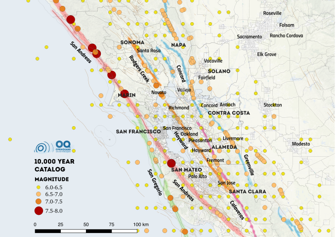

Python in scientific computing
------------------------------

*what works and what doesn't*

Michele Simionato [GEM Foundation](https://www.globalquakemodel.org)

+++



---

**What I mean by scientific computing**

- Distributed numerical simulations
- Lots of data being generated
- Nontrivial postprocessing
- Issues with CPU time, memory and data transfer

+++


---

**numpy**

- numpy is good
- had troubles with returning back structured arrays in earlier versions

---

**scipy**

- scipy is good
- and it keeps improving

---

**h5py/hdf5**

- it is good but tricky
- lots and lots of issues with structured arrays/variable length arrays
- several issues with bytes/strings at the time of the Python 2->3 migration
- recent debacle with the HDF5 1.8 -> 1.10 upgrade
- tip: silx view is a lot better than HDFView

---

**geospatial features**

- scipy.spatial.distance is good
- scipy.spatial.KDTree is fine except the documentation
- rtree is fine but I had problems with the index bulk insert in release 0.8.2 

---

**celery/rabbitmq**

- celery/rabbitmq is not ideal
- we have it for legacy reasons and because there was no dominant task
  scheduler in the Python world
- rabbitmq is meant for lots of small messages, but instead we have few
  huge messages
- rabbitmq is meant for resilience and stores everything in the mnesia
  database, but we do not need that and it is counterproductive
- lots of configurations the users can get wrong

+++

**celery/rabbitmq**

- we had problems with specific versions of rabbitmq
- using celery/redis did not work out (missing revoke)
- celery by default was keeping in memory all task results (memory leak)
- the default configuration is not the ideal one for our use case
- we had celery waiting for already completed tasks :-(

+++

**celery/rabbitmq**

- celery has 50,000+ lines of code, while rabbitmq is even more alien
- if it does not work, you are dead (but the mailing list is helpful)
- there are strong limits on the amount of data you can transfer in a
  short time

---

**zmq**

- zmq is good
- I studied the zmq book after EuroPython 2017
- I implemented what I needed in 2-3 days
- it worked really well, even if not at the first attempt
- we have now a plan B if celery/rabbitmq should fail us again
- the performance is excellent, there is no limit
- one must be careful that sent packets keeps circulating

---

**dask**

- I knew about dask since the beginning
- I was waiting for it to mature
- the documentation has improved a lot now
- `dask.distributed.Client.map` is the easy migration path I was looking for
- we are testing it, love to hear from you :-)

---

**What works and what doesn't** 

what about architecture?

+++

- if reading data is the big issue, consider using a distributed filesystem
- I you need to write a lot of data, the single writer architecture scales
  a lot more than one could expect
- for speed, it is *essential* to find out the right data structure in HDF5
- at the end a structured array
  plus a dataset with indices was the best approach
- variable-length data types are convenient, but tricky

---

**More on h5py/hdf5**

- in spite of its bugs, h5py is really nice and Pythonic
- it makes a lot of sense to serialize Python objects to HDF5
- it was easy to define a serialization protocol

```python
    def __toh5__(self):
        ...
        return self.array, self.attrs
        
    def __fromh5__(self, array, attrs):
        self.array = array
        self.attrs = attrs
```
+++
```python
    with openquake.baselib.hdf5.File('x.hdf5', 'w') as f:
         f[key] = obj 
        
    with openquake.baselib.hdf5.File('x.hdf5', 'r') as f:
         return f[key] 
```

We are converting our input files from XML to hdf5
