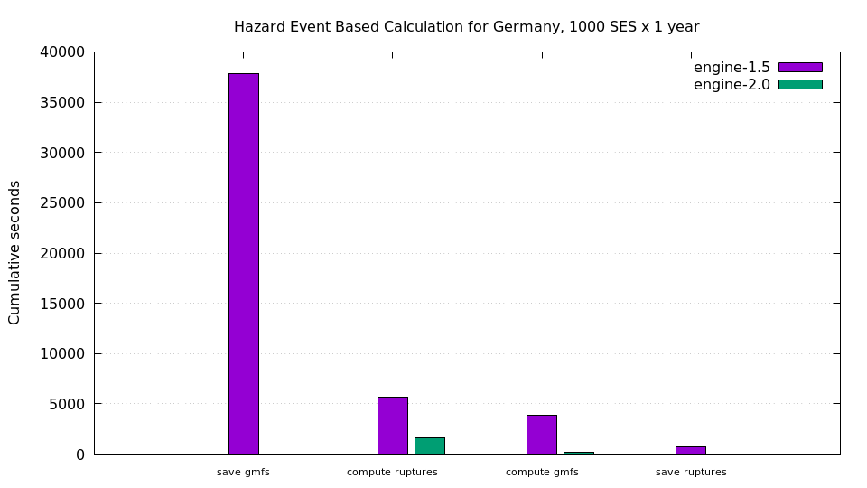

How to migrate from PostgreSQL to HDF5 and live happily ever after
-------------------------------------------------------------------

[Michele Simionato](http://micheles.github.io/author/) @ [GEM Foundation](https://www.globalquakemodel.org/)

*legacy code warrior*

The story of a *successful* software rewriting

----

<!-- .slide: data-background="./share.jpeg" -->

---

Where I come from
----------------------

- Ph. D. in Theoretical Physics (yep, I understand gravitational waves)
- contributed to Python with article/docs, author of the decorator module
- worked a couple of years as consultant (Zope/Plone + other stuff)
- worked 7 years in a Finance firm (mostly database and web programming)
- arrived at GEM in October 2012
- in charge of the earthquake simulation engine from September 2014

----

- I spent 15 years doing Physics and 14 years programming
- I am still more interested in solving the scientific problems than
  the technological problems
- lots of experience with programming in the large
- know all about code maintenance, dependencies management,
  product documentation, automatic tests, continuous integration,
  code reviews, ...
- SQL lover and generally old school boy
- still using Emacs in the 21th century
- *I don't throw away old code just because it is old*

---

What I am going to talk about
------------------------------

- "big" numerical simulations for earthquakes
- lots of floating point outputs with geospatial data
- why storing them in Postgres/PostGIS did not work
- what to do when you have a *huge* architectural problem
- technical and political issues faced
- how the migration PostGIS -> HDF5 was done
- lessons learned

---

Number chrunching with a relational database??
----------------------------------------------

- yep, seriosly
- after a few weeks on the new job I had already realized that the architecture
  was completely wrong
- everything was structured like a Django application without being  a web application
- there was an insane mix of Django objects and arrays
- large numpy arrays were stored in the database as pickled objects

----

- there were absurd things like doing the aggregation on the database with
  locks
- there were hundreds of workers writing concurrently on the same table
- the database logic was *hopelessly* coupled with the scientific logic
- strangely enough, the architecture was totally wrong but the code base
  pretty good

*Then rewrite everything?*

---

The First Law of software rewriting
-------------------------------------------

Rewriting a project takes *always* longer than writing it in the first place

(as we seasoned developers know)

----

I did not want to embark myself in such an adventure

but sometimes there is no choice :-(

---

---

What *five* orders of magnitude mean
------------------------------------

- 1 day -> less than 1 second
- 1 year -> 5 minutes

I *measured* a speedup exceeding 200,000x

(+ memory gain of 1-2 orders of magnitude)

---

Blocked by political issues
-------------------------------

- the architecture of the application had been just rewritten
  (more than an year of effort, it was ported 
  from Redis to PostgreSQL)
- a younger collegue of mine had already written a criticizing
  mail went in the wrong hands
- the official release of version 1.0 had to be ready in six months
- there was a team friction between Zurich and Pavia
- there was an artificial division between hazard code and risk code
  making it impossible to fix the risk code

---

Doing nothing for 8 months
---------------------------------

- sometimes doing nothing is the best choice
- study the codebase, maintain the old code
- let the frustration grow
- *(a good thing, if limited in time)*
- getting new case studies and adding new tests
- improve where you can (monitoring, XML parsing, concurrency, ...)

---

Waiting pays off
-----------------

- the Zurich team evaporated
- we took change of both hazard and risk in Pavia
- we started removing old cruft (10,000+ lines of code)
- we decided on a conservative strategy: keep Postgres,
  rewrite the relational schema and the slow queries

---

13 more months fighting PostgreSQL
----------------------------------

- implemented a migration mechanism
- changed most of the tables
- changed the critical queries several times
- improvements by several orders of magnitude
- still, it was not enough, as realized in the summer of 2014
- but we kept the users and scientists happy

---

The decision to drop PostgreSQL
--------------------------------

- started the oq-lite project with the *excuse* of the
  Windows porting, September 2014
- ported the simplest calculators to the new architecture
- removed gradually the geospatial queries
- kept in parallel both versions, with the same functional tests
- removed a lot of annoying unittests
- built expertise with HDF5

---

Other architectural changes
-------------------------------------

- all the concurrency is managed by a pure *map-reduce*
- made the concurrency
  layer independent from the low level parallelization technology
- changed from *everybody read/write on the database* to
  *only the controller node can read/write*
- all scientific data are now in the datastore (one .hdf5 file per calculation)
- all the metadata (i.e. start/stop time of the calculation, description,
  logs, performance information, output information) are in SQLite

----

- the workers do not write anything on the filesystem and they do not
  communicate at all with the master, except via the map-reduce (shared nothing)
- totally decoupled the database from the calculation logic
- added a DbServer in Python serializing the access to the database
  (needed for the WebUI)
- removed the ORM layer (thanks to Martin Blais dbapiext)

---

Even more changes
---------------------------------

- removed completely the need for XMLSchema, doing the validation
  entirely at the Python level
- implemented a generic serializer Python <-> XML instead of dozens
  of different serializers, one per class
- added CSV exports with the final goals of removing XML exports
- implemented a serialization protocol Python <-> hdf5 with methods
  `__toh5__` and `__fromh5__`
- supported both single user mode and multiple user mode
- ported the engine to Windows and Mac OS X
- modernized the code to Python 3

----

*all went surprisingly well!?*
------------------------------

---

Things that I already knew, reinforced
--------------------------------------

- monitoring the running system for speed and memory allocation is *essential*
- if testing is difficult, the architecture is bad
- unittests are bad, functional tests are good
- if you want performance, replace Python objects and dictionaries
  with numpy.arrays
- no ORM please

----

My technical advice
--------------------

- follow a principle of simplicity/cleanness: 95 % of the speedups and
  memory saving came for free after *removing* code
- invest your time in solving the real problem, not in complicating your
  technological stack (so I did not spend time on numbas, GPUs, Intel
  compiler, etc etc)
- always challenge the underlying assumptions
- take the most difficult problem *that you can solve* and solve it
  first
- most of all, be patient

---

Political advice
--------------------------

- don't be confrontational with your boss
- it is his job to be conservative
- take the slow way and make sure that at every little step you have
  a *measureable* improvement to show off
- performance is a good *excuse* for change
- you can raise your voice once or two in four years
- it takes time to build trust

---

Things I discovered along
----------------------------------

- using a database + ORM requires a *LOT* more memory than you think
- it is sometimes best to use all of the available memory
- sometimes it is better to run out of memory early
- the data transfer is really important
- a story about parsing XML: lxml -> ElementTree -> expat
- the migration to Python 3 had several surprises

----

Lessons about technologies
------------------

- concurrent.futures is just fine
- Travis is good
- wheels are great
- h5py is ultra-fast but can bite you

---

Regrets
-------

- nearly two years "lost" (from October 2012 to August 2014)
- I was too conservative and I should have cut more stuff/tests
- I should have investigated better what features were really important

*(but removing 50,000+ lines of code feels really great!)*

---

<!-- .slide: data-background="./engine-evol.png" -->

---

The end: Second Law of software rewriting
-------------------------------------------

Software rewriting takes *always* longer than you think

**But sometimes it is worth it :-)**

https://github.com/gem/oq-engine
